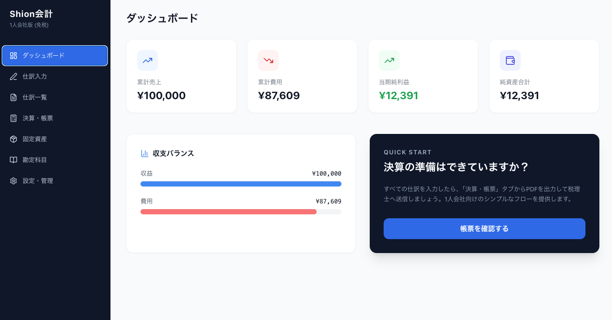

# Shion会計 (Shion Accounting)

1人会社・免税事業者に特化した、インストール不要のローカル完結型会計ソフトです。
開発者: Shion

## 🖼️ ビジュアル（Visuals）

### ダッシュボード (Dashboard)

### 決算報告書パック (Financial Report Package)

## 🌟 プロジェクトの特徴

- **完全ローカル完結**: データはブラウザ内（IndexedDB）にのみ保存されます。外部サーバーへ情報を送信しないため、財務データのプライバシーが完全に守られます。
- **決算報告書パック（1-1〜1-5）**: 表紙、貸借対照表(BS)、損益計算書(PL)、株主資本等変動計算書、個別注記表を一括で生成。提出用の正式なレイアウト、セリフ体フォント、等幅数値、および「△」表記を完備。
- **柔軟な消費税管理**: 標準税率（10%）と軽減税率（8%）を設定可能。仕訳入力時に「課税」を選択すれば、内消費税を自動計算します。
- **詳細な会社・決算期設定**: 会社名、住所、代表者名、期数、年度開始日・終了日を管理し、すべての帳票に自動反映。
- **固定資産台帳と仕訳連携**: 固定資産の登録・減価償却だけでなく、取得価額の「取得仕訳」をボタン一つで自動生成し、BSへ即座に反映。
- **洗練されたタイポグラフィ**: 数値の可読性を追求し、桁揃えが崩れないプロフェッショナルな数値フォントを採用。

## 📖 使い方の詳細

### 1. 初期設定
- **勘定科目の確認**: 「勘定科目」メニューから、使用する科目が揃っているか確認してください。必要に応じて新規追加が可能です。
- **基本情報の設定**: 「設定・管理」メニューから、会社名や年度開始日を設定します。

### 2. 日々の入力（仕訳）
- **仕訳入力**: 「仕訳入力」メニューから、日々の取引を記録します。
  - 借方と貸方の金額が一致しない場合は保存できないバリデーション機能付きです。
- **仕訳の修正**: 「仕訳一覧」から過去の取引を確認・削除できます。

### 3. 固定資産の管理
- **資産登録**: PCや備品など、10万円以上の資産を購入した場合は「固定資産」メニューに登録します。
- **減価償却**: 決算時に「償却仕訳」ボタンを押すと、耐用年数に基づいた当期の減価償却費を自動で仕訳帳に計上します。

### 4. 決算書類の出力
- **帳票の確認**: 「決算・帳票」メニューで試算表、損益計算書(PL)、貸借対照表(BS)をリアルタイムに確認できます。
- **決算報告書の作成**: 「決算報告書パック」タブを選択すると、提出に必要な一式（表紙〜注記表）が自動生成されます。
- **PDF化**: 「印刷 / PDF」ボタンを押し、ブラウザの印刷ダイアログから「PDFとして保存」を選択してください。ページごとに適切な改ページが入った提出用ファイルが作成されます。

### 5. データの保全
- **バックアップ**: 「設定・管理」から定期的にJSONファイルをエクスポートし、外部ストレージ等に保存することをお勧めします。

## 🛠 技術スタック

- **Frontend**: React 19, TypeScript, Vite
- **Database**: Dexie.js (IndexedDB)
- **Styling**: Tailwind CSS, Lucide-react

## 🚀 開発者向けセットアップ

1. `git clone https://github.com/Shion1124/Accounting_Software.git`
2. `npm install`
3. `npm run dev`

## 📄 ライセンス

MIT License
